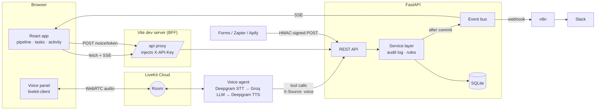

# Voice CRM: an AI-powered CRM with a Voice AI agent

A small CRM (contacts, deals, a six-stage pipeline, tasks and an activity log) that you can operate by voice. The demo data belongs to a sales team selling **CIS Infinity**, a utility billing and customer information system, to water, electric and gas utilities.

> "Move John Smith to Qualified and create a follow-up for tomorrow."

The agent understands the request, calls the CRM API, and the board updates live in the browser. A Slack notification then goes out through n8n.

| Layer | Tech |
|---|---|
| Backend | FastAPI (Python), SQLAlchemy, Pydantic |
| Database | SQLite |
| Frontend | React (Vite) |
| Real-time voice | LiveKit Cloud + LiveKit Agents |
| Speech-to-text / text-to-speech | Deepgram (`nova-3` / `aura-2`) |
| LLM + tool calling | Groq (`openai/gpt-oss-120b`, low reasoning effort) |
| Voice quality | Silero VAD, LiveKit turn detector, LiveKit noise cancellation |
| Automation | n8n, plus built-in rules |
| Notifications | Slack |

---

## Architecture



Four processes run side by side:

| Process | Port | Role |
|---|---|---|
| `[api]` backend | 8000 | Owns the data, business rules, automation and security |
| `[web]` Vite dev server | 5173 | Serves the React app and proxies `/api` to the backend, adding the API key server-side |
| `[agent]` voice agent | none (connects out to LiveKit) | Listens, understands, calls the CRM API, speaks |
| `[n8n]` automation | 5678 | Receives CRM events and posts them to Slack |

**How a voice command flows**

1. **Start voice session.** The backend mints a 15-minute LiveKit token for a fresh room. The token also dispatches the `crm-voice-agent` worker into that room.
2. **Speech to text.** The agent streams mic audio, cleaned by noise cancellation, to Deepgram. The six stage names and the CRM's contact names are passed as *keyterms*, so "Won" and "Zarnain Khalique" are transcribed correctly. A turn-detection model waits until the sentence is actually finished before replying.
3. **Tool calling.** Groq's LLM picks tools (`move_deal_stage`, then `create_follow_up`). Each tool calls the REST API with `X-Source: voice`.
4. **Business logic.** The backend resolves "jon smyth" to John Smith (fuzzy and sound-alike matching), applies the change and writes the audit log. Automation rules run in the same transaction, and events are queued.
5. **After commit.** Events go out over SSE (the card pulses on the board and a 🎙 toast appears) and over a webhook to n8n (a Slack message).
6. **Text to speech.** The agent confirms out loud, for example: *"John Smith's deal is now Qualified, with a follow-up on Friday, October 2."*

The LLM never touches the database. It can only act through ten typed tools, and the API validates every call.

### Voice agent tools

| Tool | Example request |
|---|---|
| `lookup_contact` | "What's the status of Robert Johnson's deal?" |
| `move_deal_stage` | "Move John Smith to Qualified." |
| `create_deal` | "Add a deal for David Chen: meter reading app, twenty thousand dollars." |
| `update_deal` | "Change Carlos Rivera's deal value to thirty-two thousand." |
| `create_follow_up` | "Create a follow-up for Maria Garcia next friday." |
| `complete_follow_up` | "Mark Zarnain Khalique's follow-up as done." |
| `add_note` | "Add a note to Aisha Khan: wants a phased rollout." |
| `create_lead` | "New lead Sam Lee from Oak Ridge Water, about sixty thousand." |
| `pipeline_summary` | "Give me a pipeline summary." |
| `tasks_due` | "What's due today?" |

---

## Project layout

```
.env.example          configuration template (copy to .env)
start.cmd, start.ps1  one-command launcher (Windows)
package.json          runs the four processes in one terminal (concurrently)
ruff.toml             Python lint/format settings

backend/              FastAPI + SQLite
  app/
    main.py           app, CORS, lifespan (starts the event dispatcher)
    config.py         settings from the root .env
    database.py       SQLAlchemy engine and per-request sessions
    models.py         Contact, Opportunity, Task, Activity (+ enums)
    schemas.py        validated request/response contracts
    security.py       API key, HMAC webhook verification, rate limiter
    events.py         thread-safe event bus (SSE fan-out + outbox)
    routers/          crm.py (REST), integrations.py (voice token, SSE, webhooks)
    services/         crm.py (use cases), automation.py (rules), notifier.py (n8n/Slack), common.py
  tests/              pytest suite (30 tests)
  seed.py             CIS Infinity demo data
  send_test_lead.py   sends a signed inbound webhook

agent/                LiveKit voice agent
  agent.py            system prompt, 10 CRM tools, voice pipeline setup
  crm_client.py       async API client (the agent's only way into the CRM)
  dates.py            deterministic "tomorrow / next friday" parsing
  test_agent.py       offline tests (16 tests)

frontend/             React + Vite
  vite.config.js      dev server + /api proxy that injects the API key
  src/
    App.jsx           layout, toasts, live highlights
    useCrm.js         data loading + live updates over SSE
    api.js, format.js API calls and display helpers
    components/       Pipeline, ContactsTable, ContactDrawer, TaskList, ActivityFeed,
                      NewLeadDialog, VoicePanel, VoiceSession (lazy-loaded)

n8n/
  crm-automation.json importable workflow
```

---

## Demo data

`seed.py` loads eight deals across the pipeline. Open tasks have due dates relative to today: some are overdue, some are due today, and some are upcoming.

| Stage | Deal | Contact | Utility | Value |
|---|---|---|---|---|
| New | CIS Infinity billing migration | John Smith, Billing Manager | Riverside Water District | $85,000 |
| New | Customer self-service portal | Maria Garcia, Customer Service Lead | Northfield Electric Co-op | $42,000 |
| New | Smart meter data integration | Robert Johnson, IT Director | Lakeview Gas & Power | $110,000 |
| Contacted | Billing analytics dashboard | Zarnain Khalique, Finance & Analytics Manager | Bluewater Utility Authority | $64,000 |
| Qualified | Online payment module | Carlos Rivera, Utility Operations Manager | Pine Valley Municipal Utilities | $28,000 |
| Qualified | Outage notification add-on | David Chen, Operations Manager | Harbor City Energy | $19,000 |
| Proposal | Work order management | Aisha Khan, Public Works Administrator | Cedar Creek Public Works | $36,000 |
| Won | Full CIS Infinity suite | Emily Davis, General Manager | Summit County Utilities | $150,000 |

---

## Setup

**Prerequisites:**
- Python 3.12+ (tested on 3.14)
- Node.js 24+ (n8n 2.x requires it; the rest works on Node 20+)
- Free accounts on [LiveKit Cloud](https://cloud.livekit.io), [Deepgram](https://console.deepgram.com) and [Groq](https://console.groq.com)

n8n and Slack are optional.

### 1. Configure secrets

```bash
cp .env.example .env
```

Fill in `LIVEKIT_URL`, `LIVEKIT_API_KEY`, `LIVEKIT_API_SECRET`, `DEEPGRAM_API_KEY` and `GROQ_API_KEY`. `CRM_API_KEY` and the webhook secrets just need to be long random strings:

```bash
python -c "import secrets; print(secrets.token_urlsafe(32))"
```

Set `APP_TIMEZONE` to your own timezone (for example `Asia/Karachi`), so "today" and "tomorrow" match your clock.

### Quick start: one command (Windows)

```powershell
.\start.cmd
```

In PowerShell (including the VS Code terminal) the leading `.\` is required, because PowerShell doesn't run files from the current folder by name alone. In Command Prompt, plain `start.cmd` works, and you can also double-click it in Explorer.

The launcher:

1. creates the Python virtual environments and installs dependencies, on the first run and again only when a `requirements.txt` changes;
2. downloads the voice models once (VAD, turn detector, noise cancellation);
3. installs the Node packages, and loads the demo data if there is no database yet;
4. checks that ports 8000, 5173 and 5678 are free;
5. runs the backend, voice agent, frontend and n8n in one terminal with colored `[api] [agent] [web] [n8n]` logs.

Then open http://localhost:5173 (CRM) and http://localhost:5678 (n8n). **Ctrl+C** stops all four; answer **Y** if Windows asks "Terminate batch job?".

| Command | Effect |
|---|---|
| `.\start.cmd -Reset` | Reload the demo data (wipes the database) |
| `.\start.cmd -NoN8n` | Don't start n8n |
| `npm test` | Run the backend and agent test suites |

On macOS/Linux, or to run each service yourself, use the manual steps below (activate a venv with `source .venv/bin/activate` instead of `.venv\Scripts\activate`).

### 2. Backend (terminal 1)

```bash
cd backend
python -m venv .venv
.venv\Scripts\activate
pip install -r requirements.txt
python seed.py                  # demo data
uvicorn app.main:app --port 8000
```

Interactive API docs: http://localhost:8000/docs. Click **Authorize** and paste `CRM_API_KEY` to try the endpoints.

### 3. Voice agent (terminal 2)

```bash
cd agent
python -m venv .venv
.venv\Scripts\activate
pip install -r requirements.txt
python agent.py download-files  # one-time: VAD, turn detector, noise cancellation models
python agent.py dev
```

> Tip: `python agent.py console` talks to the agent straight from your terminal's mic and speakers, with no browser needed.

### 4. Frontend (terminal 3)

```bash
cd frontend
npm install
npm run dev
```

Open http://localhost:5173, click **Start voice session**, allow the microphone, and speak. You can also type commands in the voice panel, or click the example chips.

### 5. Automation: n8n + Slack (optional)

With neither configured, everything still works: events show up live in the UI. With only `SLACK_WEBHOOK_URL` set, the backend posts to Slack directly. If n8n is configured but not running, or the workflow isn't active, the backend also falls back to direct Slack, so notifications keep flowing.

**n8n runs locally with npx.** There's nothing to install separately: `start.cmd` runs `npx n8n` as the `[n8n]` process. The backend sends each CRM event to n8n's webhook, and n8n formats it and posts it to Slack.

- **First start:** npx downloads n8n (about 2.5 GB), which can take 10+ minutes. Later starts use the cache and take seconds.
- **Where your data lives:** workflows and credentials are saved in `%USERPROFILE%\.n8n`, so they survive restarts.
- **Running it by hand:** `cd n8n` then `npx n8n`. Start it from the `n8n` folder, because n8n loads any `.env` in the folder it starts from and the project-root `.env` would confuse it.

One-time workflow setup:

1. Open http://localhost:5678, create the owner account, then go to **Workflows → Import from file** and choose `n8n/crm-automation.json`.
2. **CRM Event Webhook** node → *Credential for Header Auth* → create new: Name `X-Webhook-Secret`, Value = `N8N_WEBHOOK_SECRET` from `.env`.
3. **Post to Slack** node: replace the URL with `SLACK_WEBHOOK_URL` from `.env`.
4. Save, then toggle the workflow **Active**.

`.env.example` already sets `N8N_WEBHOOK_URL=http://localhost:5678/webhook/crm-events`. Use the production URL (`/webhook/`), not the test URL (`/webhook-test/`).

To test the inbound webhook (simulating a website form, Zapier or Apify), run this while the backend is up:

```bash
cd backend
python send_test_lead.py "Jane Doe" "Maple Grove Water Authority"
```

### Tests and linting

```bash
npm test                                   # both suites (Windows)
cd backend && python -m pytest -q          # 30 tests: API, automation, security, demo data, name matching
cd agent   && python -m pytest -q          # 16 tests: date parsing, deal selection, tool registration
cd backend && python -m ruff check .. && python -m ruff format --check ..   # lint + format check
```

---

## Demo script

| Say | What happens |
|---|---|
| "Move John Smith to Qualified and create a follow-up for tomorrow." | His *CIS Infinity billing migration* card moves from New to Qualified and pulses. The follow-up is due tomorrow (tagged `voice`). Slack gets a message. |
| "What's the status of Zarnain Khalique's deal?" | Reads the title, utility, deal, stage and open tasks. The name resolves even if speech-to-text writes "Zarnayn Khaleeq". |
| "What's due today?" | Reads open and overdue tasks. |
| "Add a note to Maria Garcia: wants the self-service portal to support autopay." | The note appears on Maria's timeline. |
| "Change Carlos Rivera's deal value to thirty-two thousand." | The deal's value updates on the board, and the change is logged. |
| "Move Aisha Khan to Won." | Her *Work order management* deal goes to *Won*. Open tasks auto-close, an onboarding task is created, and Slack gets 🎉. |

If a request is ambiguous (an unclear name, stage or date), the agent asks one short question and waits for the answer instead of guessing.

---

## Automated workflows

**Built-in rules** ([backend/app/services/automation.py](backend/app/services/automation.py)) run in the same DB transaction as the triggering change:

| Trigger | Rule |
|---|---|
| New lead with a deal | Create an "Initial outreach" follow-up due today |
| Deal → Qualified | Ensure an open follow-up exists (next business day); never duplicates |
| Deal → Won | Close open tasks, create a "Kick off onboarding" task |
| Deal → Lost | Close open tasks |
| Person requests a follow-up | Supersedes the automated one for that deal instead of adding a second |

That last rule is what makes the headline voice command clean. Moving to Qualified schedules an automatic follow-up, and "…create a follow-up for tomorrow" then reschedules that same task instead of creating a duplicate.

**n8n workflow** ([n8n/crm-automation.json](n8n/crm-automation.json)): **CRM Event Webhook → Format Slack Message → Post to Slack**. It posts stage changes, wins and losses, new leads and voice-scheduled follow-ups.

Outbound delivery runs in a background worker with retries, so a slow or failing webhook never blocks a CRM request or the voice agent.

---

## API

All `/api/*` routes require `X-API-Key`, except `/api/health` and the signed inbound webhook.

| Method | Path | Purpose |
|---|---|---|
| GET | `/api/health` | Liveness check |
| GET | `/api/pipeline` | Stages with deals, counts and totals |
| GET/POST | `/api/contacts` | List/search, or create (optionally with a deal) |
| GET | `/api/contacts/resolve?name=` | Fuzzy name match for voice (`confident` + candidates) |
| GET | `/api/contacts/{id}` | Contact with deals, open tasks and timeline |
| POST | `/api/contacts/{id}/notes` | Add a note |
| GET/POST | `/api/opportunities` | List or create deals |
| PATCH | `/api/opportunities/{id}` | Change a deal's name and/or value |
| PATCH | `/api/opportunities/{id}/stage` | Move stage (triggers automation) |
| GET/POST | `/api/tasks` | List (filter by `status`, `due_on_or_before`) or create |
| POST | `/api/tasks/{id}/complete` | Complete a task |
| GET | `/api/activities` | Audit log |
| GET | `/api/events` | Server-Sent Events stream of all changes |
| POST | `/api/voice/token` | Short-lived LiveKit token + agent dispatch (rate-limited) |
| POST | `/api/webhooks/leads` | Inbound lead, HMAC-signed |

---

## Security

- **No secrets in the browser or the repo.** The Vite proxy adds `X-API-Key` server-side. The browser receives only a short-lived, single-room LiveKit JWT, never the LiveKit secret. All secrets live in `.env`, which is git-ignored; `.env.example` holds only blanks.
- **API key auth** on every CRM route, compared in constant time.
- **HMAC-signed inbound webhooks.** `X-Signature: sha256=HMAC(secret, "{timestamp}.{body}")`. Timestamps older than 5 minutes are rejected, which blocks replays. The signature is verified on the raw bytes before parsing. Senders get no credential that can read CRM data.
- **n8n authentication.** Outbound events carry `X-Webhook-Secret` for n8n's Header Auth.
- **Least-privilege AI.** The LLM can only call ten narrow tools through the public API: no SQL, no deletes. Ambiguous requests make it ask instead of guessing, and it never records a requested change as a note.
- **Provenance.** Every change records its source (`ui`, `voice`, `automation`, `webhook`). Clients can claim only `ui` or `voice`; `automation` and `webhook` are set server-side only.
- **Input validation.** Pydantic schemas bound every field (lengths, enums, non-negative values). The ORM prevents SQL injection.
- **Hardening.** CORS is locked to the frontend origin, rate limits apply to the token and webhook endpoints, and SQLite foreign keys are enforced.

**For production** I would replace the shared API key with per-user auth (an OIDC session at the BFF plus per-user LiveKit identities). I would also move to Postgres, use a durable queue for webhooks instead of the in-process outbox, and serve over HTTPS only.

---

## Design decisions

- **Tools take names, not IDs.** `move_deal_stage("John Smith", "Qualified")` does its lookup internally. The two-step command then needs 2 LLM tool calls instead of 4, which is faster and leaves the model fewer chances to go wrong.
- **Dates are parsed in code, not by the LLM.** The model passes "tomorrow" or "next friday", and [agent/dates.py](agent/dates.py) resolves it in the business timezone. LLM date arithmetic is a common failure mode.
- **Speech errors are handled at three layers.** Keyterms bias recognition toward CRM names and stages. Sound-alike matching in the backend tolerates spelling variants. The prompt maps "one" to the Won stage and tells the agent to ask rather than guess.
- **Turns end on meaning, not silence.** The turn detector keeps a mid-sentence pause from being treated as a finished request.
- **Events publish only after commit.** Nobody gets a Slack message about a change that rolled back.
- **One service layer.** The UI, the voice agent and webhooks all go through the same code, so auditing and automation behave the same regardless of the source.
- **Voice code is lazy-loaded.** The dashboard loads about 74 KB gzipped. The LiveKit SDK loads only when you start a session.

---

## Troubleshooting

| Problem | Fix |
|---|---|
| `start.cmd is not recognized` | In PowerShell, run `.\start.cmd`. |
| `Port 8000 (backend) is in use…` | Another copy is still running. Close that window, or stop the PID the message shows. |
| n8n takes a long time on the first start | It's downloading (about 2.5 GB). Later starts are fast. |
| n8n is skipped at startup | Node.js is older than 24. Upgrade Node, or run with `-NoN8n`. |
| "Voice unavailable" in the UI | Check the `LIVEKIT_*` values in `.env` and that the `[agent]` log shows `registered worker`. |
| "Today" or "tomorrow" is off by a day | Set `APP_TIMEZONE` in `.env` to your timezone. |
| No Slack messages | Check `SLACK_WEBHOOK_URL`. If you use n8n, check that the workflow is **Active**. |
